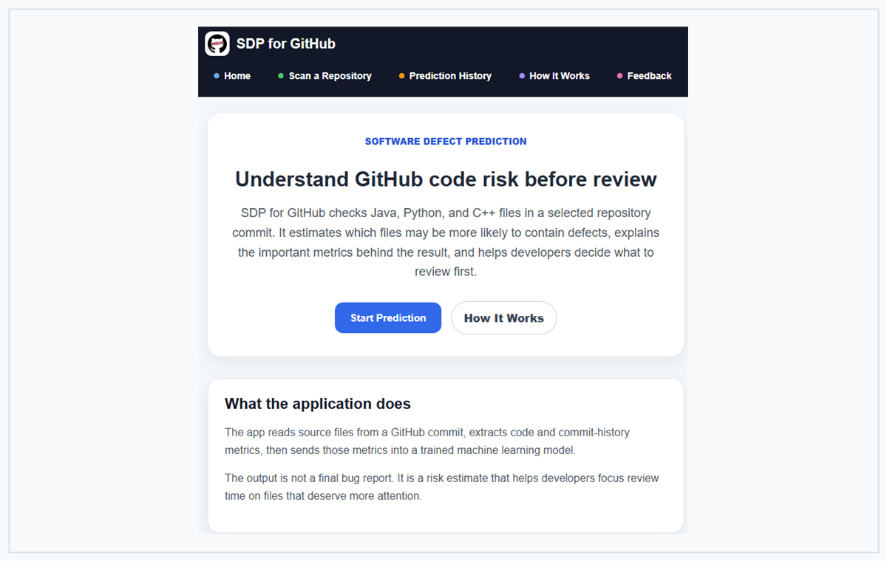
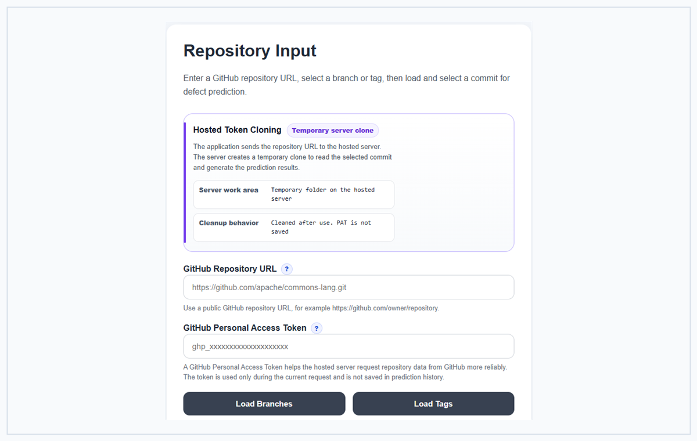
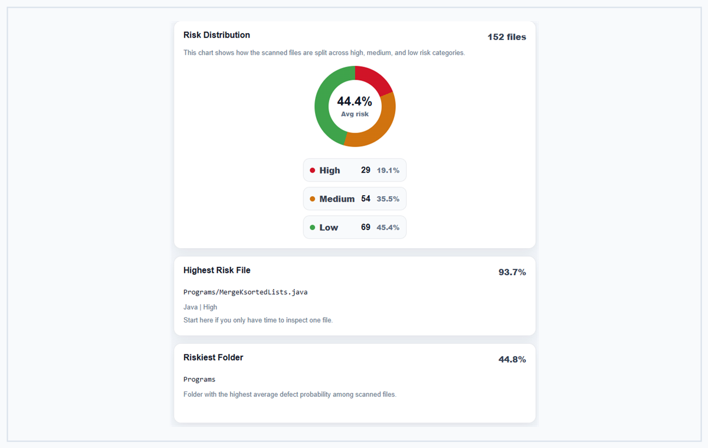
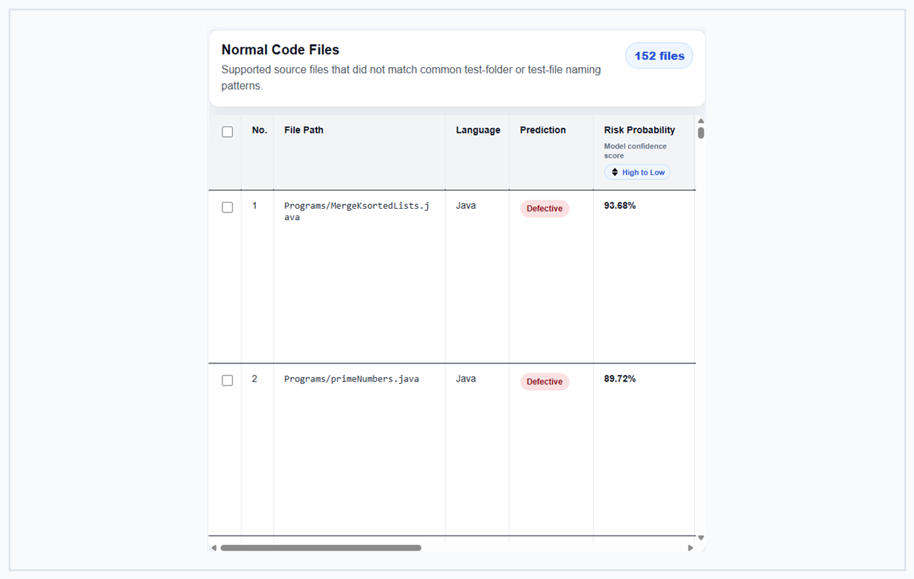
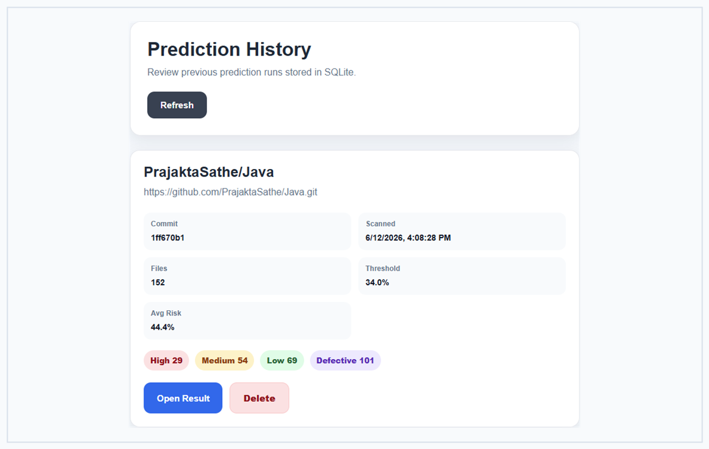
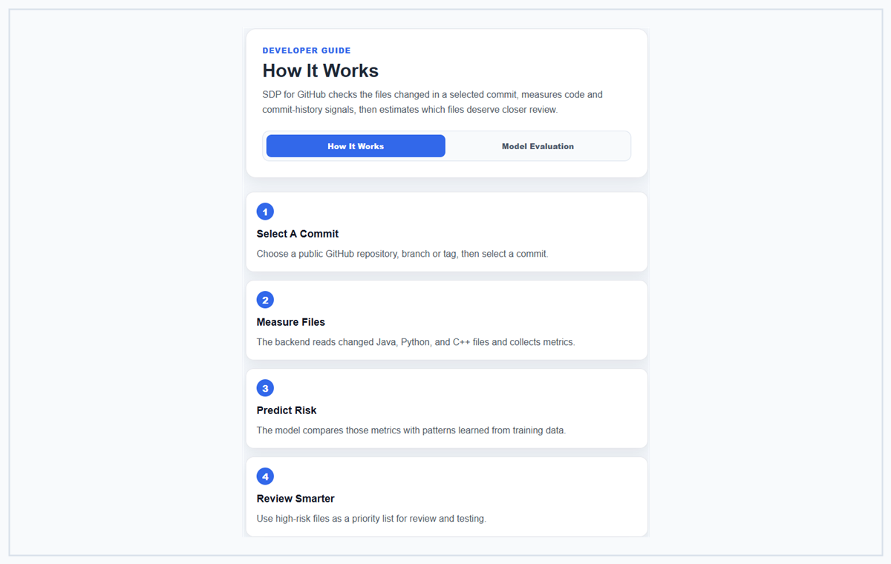
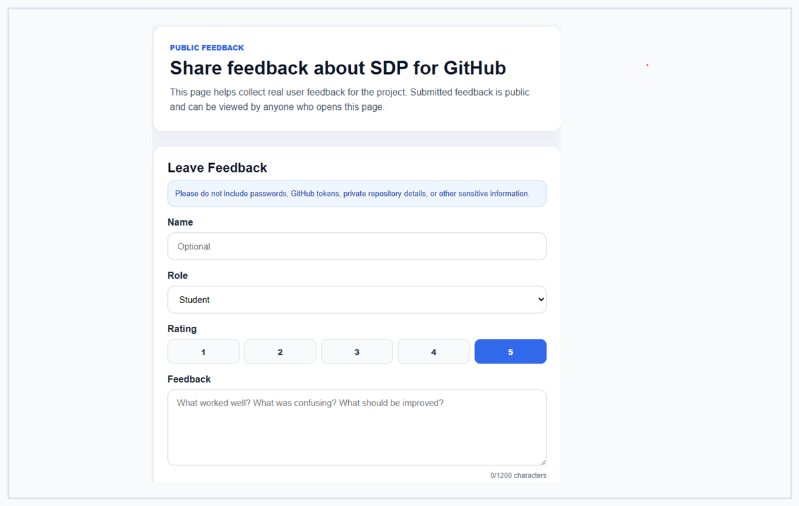
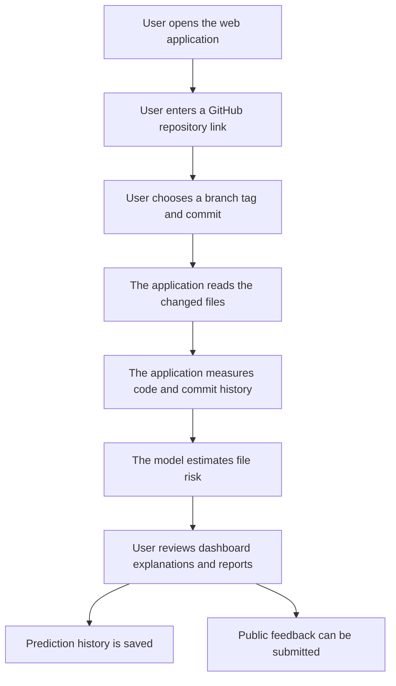
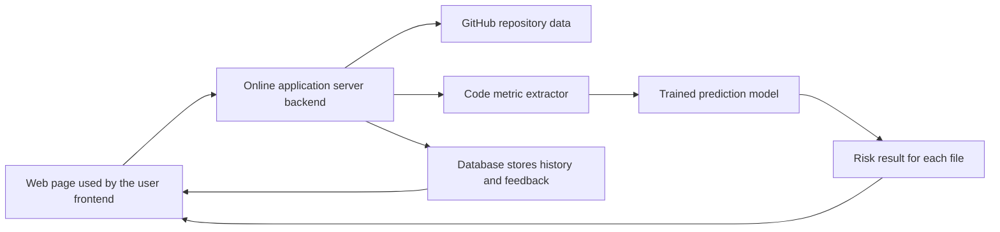
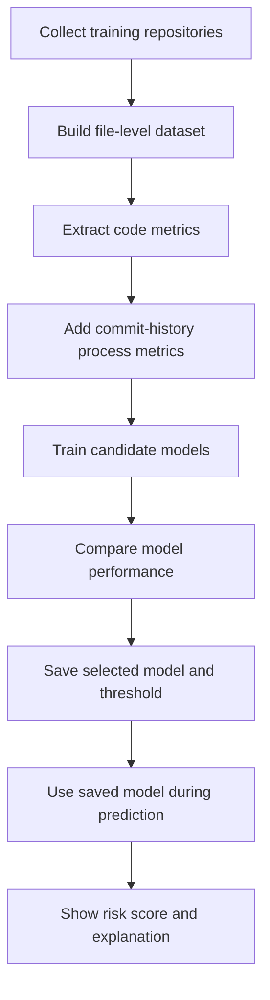

<p align="center">
  
</p>

# SDP for GitHub

**SDP for GitHub** is a Software Defect Prediction application for GitHub repositories. It analyzes the files changed in a selected commit and estimates which files may need closer review before release.

The application is built as a Academic Final Year Project demonstration with a React frontend, FastAPI backend, PostgreSQL storage for the live demo, SQLite fallback for local development, GitHub repository inspection, static metric extraction, machine learning prediction, dashboard visualization, report export, prediction history, and public feedback.

## Live Demo

Try the application here:

[https://sdp-for-git-hub.vercel.app/](https://sdp-for-git-hub.vercel.app/)

Please help through feedback of this application. The feedback page is public, so any feedback submitted there can be viewed by everyone who opens the page.

## Application Preview

| Home Page | Repository Input |
| --- | --- |
|  |  |
| Introduces the application and explains the prediction purpose. | Lets users enter a GitHub repository, choose a branch or tag, <br> select a commit, and run prediction. |

| Prediction Dashboard | Prediction Results |
| --- | --- |
|  |  |
| Summarizes risk distribution, high-risk files, <br> folders, and language-level results. | Shows file-level predictions, risk probability, explanations, <br> filters, and export options. |

| Prediction History | How It Works |
| --- | --- |
|  |  |
| Saves completed prediction runs so users can <br> revisit earlier results. | Explains the model workflow and evaluation evidence in <br> developer-friendly language. |

| Public Feedback |
| --- |
|  |
| Allows users to submit feedback and view feedback <br> submitted by other users. |

## How The System Works

### Overall System Flow



### Application Components



### Machine Learning Workflow



## Key Features

- Public GitHub repository scanning by branch, tag, and commit.
- File-level defect risk prediction for Java, Python, and C++ files.
- GitHub API commit loading so large repositories do not need to be cloned just to display commit pages.
- Progress status while the backend analyzes a commit.
- Configurable prediction sensitivity for changing the defect threshold.
- Hosted temporary cloning for the live application.
- Risk dashboard with summary cards and charts.
- Separate display for normal code files and potential test files.
- File path, language, risk level, prediction label, and probability filtering.
- CSV and PDF export for selected prediction rows.
- Prediction history stored in PostgreSQL on the live demo and SQLite during local fallback.
- Public feedback page stored in PostgreSQL on the live demo and SQLite during local fallback.
- How It Works page for non-ML developers and evaluators.
- Training scripts and notebooks for model building and evaluation.

## Tech Stack

| Layer | Technology |
| --- | --- |
| Frontend | React, Vite, TypeScript |
| Backend | FastAPI, Python |
| Machine Learning | scikit-learn, XGBoost, pandas, joblib |
| Repository Access | Git, GitPython, GitHub API |
| Storage | PostgreSQL for deployment, SQLite fallback for local development |
| Deployment | Vercel frontend, Render backend |

## Limitations

- The backend is hosted on Render free tier, so it may sleep after inactivity. The first request after sleep can be slow.
- Vercel hosts only the frontend. Prediction requires the Render backend to be running.
- Large repositories may take longer to clone, scan, and predict.
- The public demo uses `MAX_SOURCE_FILES_PER_RUN=500`, which means each prediction scans up to 500 supported Java, Python, and C++ files.
- Temporary repository clones are created on the hosted backend server during prediction.
- The live demo now uses PostgreSQL for more stable feedback and prediction history. Free database or hosting limits may still apply depending on the provider plan.
- Private repository prediction is not treated as a full production feature in this version.
- The model result is a decision-support signal, not a guaranteed defect label.

## How To Setup Locally

### Prerequisites

Install these tools first.

| Tool | Recommended Version | Download |
| --- | --- | --- |
| Python | 3.10 or newer | [python.org/downloads](https://www.python.org/downloads/) |
| Node.js | 20 LTS or newer | [nodejs.org/download](https://nodejs.org/en/download) |
| Git | Latest stable | [git-scm.com/downloads](https://git-scm.com/downloads) |

On Windows, enable **Add python.exe to PATH** during Python installation.

### 1. Clone The Repository

```powershell
git clone <repository-url>
cd SDP-for-GitHub
```

If you downloaded the project as a ZIP file, extract it and open a terminal inside the extracted `SDP-for-GitHub` folder.

### 2. Create A Python Virtual Environment

```powershell
python -m venv .venv
.\.venv\Scripts\Activate.ps1
```

If PowerShell blocks activation, run this in the same terminal:

```powershell
Set-ExecutionPolicy -Scope Process -ExecutionPolicy Bypass
.\.venv\Scripts\Activate.ps1
```

### 3. Install Backend Dependencies

```powershell
pip install --upgrade pip
pip install -r "backend\backend requirements.txt"
```

### 4. Start The Backend

```powershell
cd backend
uvicorn main:app --reload
```

Backend URL:

```text
http://127.0.0.1:8000
```

API documentation:

```text
http://127.0.0.1:8000/docs
```

### 5. Install Frontend Dependencies

Open a second terminal from the project root.

```powershell
cd frontend
npm install
```

Create a `.env` file inside the `frontend` folder:

```env
VITE_API_BASE_URL=http://127.0.0.1:8000
```

### 6. Start The Frontend

```powershell
npm run dev
```

Frontend URL:

```text
http://127.0.0.1:5173
```

Open the local web app URL in your browser and use the application.

## How To Use The Application

1. Open the live demo or local web app.
2. Go to **Scan a Repository**.
3. Enter a public GitHub repository URL.
4. Load branches or tags.
5. Select a branch or tag.
6. Load commits.
7. Select a commit.
8. Adjust prediction sensitivity if needed.
9. Run prediction and wait for progress to complete.
10. Review the dashboard and file-level results.
11. Export selected rows or revisit the run from Prediction History.
12. Submit feedback from the Feedback page if you tested the application.

Example repository URL format:

```text
https://github.com/owner/repository.git
```

The application also accepts common GitHub HTTPS repository URLs without `.git` and normalizes them internally.

## Deployment Files In This Repository

These files help the hosted backend run on Render. They are included for deploying live service, but if you are a local user, do not need to edit them.

| File | Purpose |
| --- | --- |
| `Dockerfile` | Packages the FastAPI backend with Python, Git, backend code, and model files so Render can run the API service. |
| `.dockerignore` | Keeps unnecessary local files out of the Docker image, such as `.git`, virtual environments, caches, local databases, frontend build output, and `node_modules`. |
| `render.yaml` | Optional Render blueprint configuration for backend hosting, health checks, environment variables, and database connection setup. |

## Database Storage

The deployed application use PostgreSQL so prediction history and public feedback do not disappear when the backend restarts. Which happen during SQLite.

Set this environment variable on the backend hosting service:

```text
DATABASE_URL=<your-postgresql-connection-url>
```

When `DATABASE_URL` is set, prediction history and feedback are stored in PostgreSQL. When it is not set, the backend falls back to the local SQLite file configured by `PREDICTION_HISTORY_DB_PATH`.

## Supported Languages

| Language | Extensions |
| --- | --- |
| Java | `.java` |
| Python | `.py` |
| C++ | `.cpp`, `.cc`, `.cxx`, `.hpp`, `.h`, `.hh` |

The live prediction extractor scans supported files and maps metrics into a shared feature format for the trained model.

## Prediction Result Interpretation

| Section | Meaning |
| --- | --- |
| Normal Code Files | Source files that do not match common test-folder or test-file naming patterns. |
| Potential Test Files | Files that are still predicted, but matched conservative test naming hints such as `test`, `tests`, `.spec`, or `.test`. |

Potential test files are separated instead of removed because automatic test detection can be wrong. This lets reviewers keep the prediction result while interpreting the file type with more context.

The explanation section uses SHAP-style contribution signals:

- **Increases score** means the metric pushed the model toward a higher defect risk score.
- **Lowers score** means the metric pushed the model toward a lower defect risk score.
- **Confidence note** appears when one metric dominates the explanation.

## Machine Learning Setup

The app expects trained model artifacts inside:

```text
ml_workspace/models/
```

Important files:

```text
github_defect_prediction_model.pkl
github_model_features.pkl
github_prediction_threshold.pkl
github_feature_transform_stats.pkl
```

If these files already exist, the application can run without retraining. Retraining is only needed when the dataset changes or when model quality needs improvement.

## Training Workflow

Go to the ML workspace:

```powershell
cd ml_workspace
```

### Build A New Dataset

Edit this file and add repository URLs:

```text
ml_workspace/data/repositories.txt
```

Run:

```powershell
python scripts\build_multi_repo_dataset.py
```

Suggested inputs for an FYP training run:

```text
max commits per repo: 500
max rows per repo: 800
```

### Append New Repositories Without Rebuilding

Edit:

```text
ml_workspace/data/repositories_append.txt
```

Run:

```powershell
python scripts\append_multi_repo_dataset.py
```

The append script backs up the current dataset, adds new rows, and removes duplicate repository, commit, and file rows.

### Analyze The Dataset

```powershell
python scripts\analyze_github_dataset.py
```

Use this before training to check language distribution, label balance, duplicate rows, and metric patterns.

### Add Process Metrics To An Existing Dataset

If the dataset was created before process metrics were added, run:

```powershell
python scripts\enrich_dataset_process_metrics.py
```

This adds commit-history features such as previous file changes, recent change count, previous bug-fix count, days since last change, previous churn, and author-file history.

### Train The Model

```powershell
python scripts\train_github_dataset_model.py
```

The training script compares Logistic Regression, Random Forest, and XGBoost. It uses hyperparameter search and threshold tuning, then saves the selected model and evaluation outputs.

### Analyze Feature Importance

```powershell
python scripts\analyze_github_feature_importance.py
```

Generated outputs are saved under:

```text
ml_workspace/models/
ml_workspace/results/
```

After retraining, restart the backend so it loads the latest model files.

## ML Teaching Notebooks

The `ml_workspace/notebooks` folder contains report-friendly notebooks that explain the machine learning workflow step by step.

| Notebook | Purpose |
| --- | --- |
| `01_dataset_building.ipynb` | Repository collection and dataset overview charts. |
| `02_process_metric_enrichment.ipynb` | Commit-history process metrics and their distributions. |
| `03_model_training_optimization.ipynb` | Model comparison and training outputs. |
| `04_model_evaluation_feature_importance.ipynb` | Confusion matrix and feature importance evidence. |

Install notebook visualization dependencies with:

```powershell
cd ml_workspace
pip install -r requirements.txt
```

## Notes For Evaluation

- High-risk files should be reviewed more carefully, tested more thoroughly, or inspected for complexity and coupling.
- Model quality depends on dataset size, label balance, and repository relevance.
- Static metrics do not capture runtime failures, developer intent, production incidents, or test coverage quality.
- The feedback page is public so evaluators and testers can leave visible comments about the application.

## License

This repository is prepared as an academic Final Year Project. Add a formal license file if the project will be published or reused outside the university submission context.


