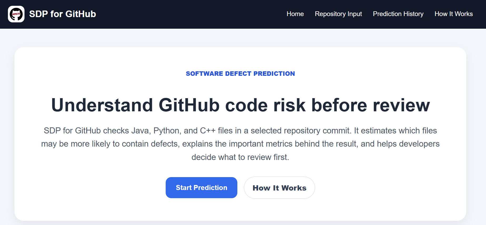
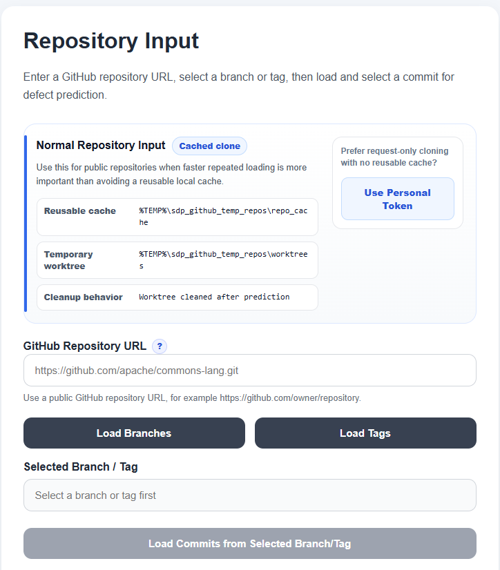
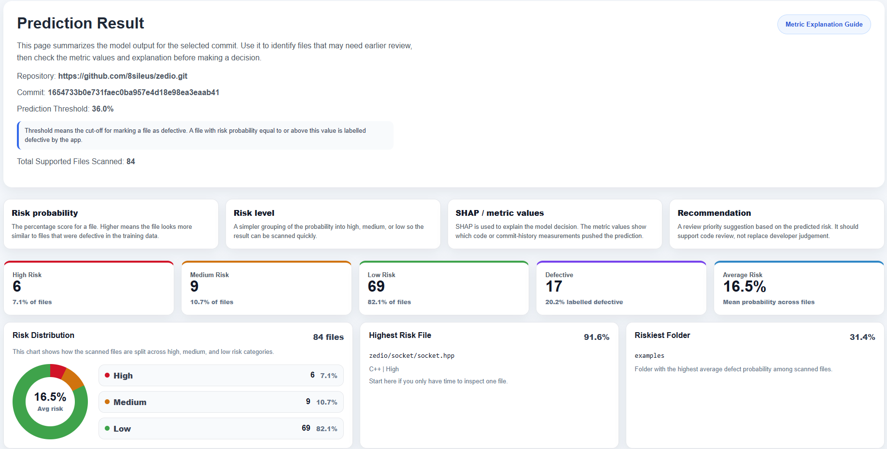
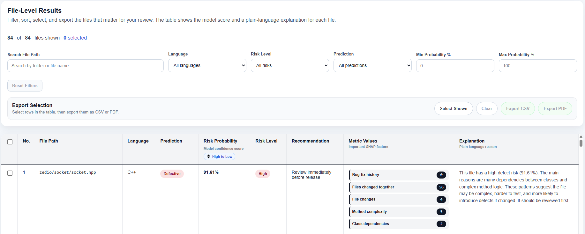
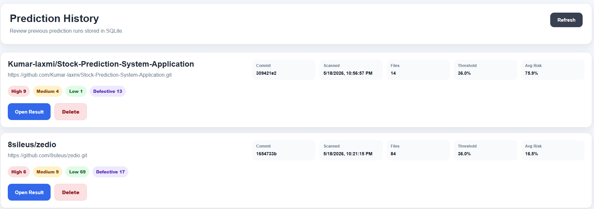

<p align="center">
  
</p>

# SDP for GitHub

**SDP for GitHub** is a Software Defect Prediction application that analyzes a
public GitHub repository at a selected commit and predicts file-level defect
risk. It is designed for developers, reviewers, and project maintainers who want
an early indication of which source files may need more attention before
reviewing or releasing code.

The system combines GitHub repository inspection, static code metric extraction,
a trained machine learning model, prediction history, report export, and a
developer-friendly explanation page.

## Application Showcase

The application is designed as a complete defect prediction workflow: introduce
the system, select a repository commit, run prediction, review the risk
dashboard, inspect file-level explanations, and revisit previous prediction
runs.

### 1. Home Page

The home page introduces the purpose of SDP for GitHub in student-friendly
language. It explains risk probability, prediction threshold, and SHAP-style
explanation before the user starts.

<p align="center">
  
</p>

### 2. Repository Input

The repository input page lets the user enter a GitHub repository URL, choose a
branch or tag, select a commit, and configure prediction sensitivity. It also
explains the normal cached clone mode and the request-only PAT clone mode.

<p align="center">
  
</p>

### 3. Prediction Dashboard

After prediction completes, the dashboard summarizes the result with high,
medium, and low risk counts, average risk, highest-risk file, riskiest folder,
and language-level risk charts.

<p align="center">
  
</p>

### 4. File-Level Prediction Results

The result table supports sorting, filtering, row selection, metric value review,
plain-language explanations, and export selection. This helps the user move from
an overall dashboard into specific files that may need review.

<p align="center">
  
</p>

### 5. Prediction History

Completed prediction runs are saved into SQLite so users can revisit earlier
results without immediately rerunning the same analysis.

<p align="center">
  
</p>

## What The Application Does

| Step | Description |
| --- | --- |
| 1. Repository input | Accepts a GitHub repository URL and loads branches, tags, and commits. |
| 2. Commit selection | Lets the user choose the exact commit to analyze. |
| 3. Metric extraction | Extracts static code metrics and commit-history process metrics from supported files. |
| 4. ML prediction | Predicts file-level defect risk using the trained model. |
| 5. Explanation | Shows important metric values and plain-language reasoning for each file. |
| 6. Dashboard review | Summarizes risk distribution, highest-risk files, folders, and language-level trends. |
| 7. History and export | Saves completed runs to SQLite and exports selected results as CSV or PDF. |

This project is suitable for a Final Year Project demonstration because it shows
the full workflow from repository input to model-backed decision support.

## Key Features

- GitHub repository, branch, tag, and commit selection.
- File-level defect prediction for Java, Python, and C++.
- Prediction progress status while the backend is analyzing a commit.
- Configurable prediction sensitivity for adjusting the defect cutoff.
- Optional PAT request mode for users who do not want a reusable repository
  mirror cache.
- Risk dashboard with summary cards, charts, high-risk files, and language
  breakdowns.
- Search and filtering by file path, language, risk level, prediction label, and
  probability range.
- CSV and PDF report export for selected prediction rows.
- Prediction history stored in SQLite.
- "How It Works" page for non-ML developers and project evaluators.
- Backend repository caching to reduce repeated GitHub operations.
- Training scripts for building, appending, analyzing, and retraining the model.

## Tech Stack

| Layer | Technology |
| --- | --- |
| Frontend | React, Vite, TypeScript |
| Backend | FastAPI, Python |
| Machine Learning | scikit-learn, XGBoost, pandas, joblib |
| Repository Access | Git, GitPython |
| Storage | SQLite |
| Charts/UI | React components and CSS |

## Prerequisites

Install these before running the project locally.

| Tool | Recommended Version | Download |
| --- | --- | --- |
| Python | 3.10 or newer | [python.org/downloads](https://www.python.org/downloads/) |
| Node.js | 20 LTS or newer | [nodejs.org/download](https://nodejs.org/en/download) |
| Git | Latest stable | [git-scm.com/downloads](https://git-scm.com/downloads) |

During Python installation on Windows, enable **Add python.exe to PATH**. During
Git installation, the default options are usually fine.

## Local Setup Guide

The project needs two terminals:

- Terminal 1 runs the FastAPI backend.
- Terminal 2 runs the React frontend.

### 1. Open The Project

Clone the repository and enter the project folder:

```powershell
git clone <repository-url>
cd SDP-for-GitHub
```

If you already downloaded the project as a ZIP file, extract it and open a
terminal inside the extracted `SDP-for-GitHub` folder.

All commands below assume your terminal is already at the project root.

### 2. Create A Python Virtual Environment

From the project root:

```powershell
python -m venv .venv
.\.venv\Scripts\Activate.ps1
```

If PowerShell blocks virtual environment activation, run:

```powershell
Set-ExecutionPolicy -Scope Process -ExecutionPolicy Bypass
.\.venv\Scripts\Activate.ps1
```

### 3. Install Backend Dependencies

With the virtual environment activated:

```powershell
pip install --upgrade pip
pip install -r "backend\backend requirements.txt"
```

### 4. Start The Backend

```powershell
cd backend
uvicorn main:app --reload
```

The backend runs at:

```text
http://127.0.0.1:8000
```

FastAPI API documentation is available at:

```text
http://127.0.0.1:8000/docs
```

### 5. Install Frontend Dependencies

Open a second terminal and go to the frontend folder:

```powershell
cd frontend
npm install
```

### 6. Start The Frontend

```powershell
npm run dev
```

The frontend runs at:

```text
http://127.0.0.1:5173
```

Open this URL in your browser and use the application.

## How To Use The Application

1. Start the backend and frontend.
2. Open `http://127.0.0.1:5173`.
3. Enter a public GitHub repository URL.
4. Load branches or tags.
5. Select a branch or tag.
6. Load commits.
7. Select a commit.
8. Run prediction.
9. Wait for the progress status to complete.
10. Review the risk dashboard and result table.
11. Export the report or revisit the run from Prediction History.

Example repository URL format:

```text
https://github.com/owner/repository.git
```

The application also accepts common GitHub HTTPS repository URLs without `.git`
and normalizes them internally.

## Supported Languages

The live prediction extractor scans these source files:

| Language | Extensions |
| --- | --- |
| Java | `.java` |
| Python | `.py` |
| C++ | `.cpp`, `.cc`, `.cxx`, `.hpp`, `.h`, `.hh` |

The model uses a shared static metric feature set:

| Feature | Meaning |
| --- | --- |
| `nosi` | Number of static invocations or similar interaction indicators |
| `dit` | Depth of inheritance tree approximation |
| `cbo` | Coupling between objects approximation |
| `rfc` | Response for class approximation |
| `loc` | Lines of code |
| `comparisonsQty` | Number of comparison expressions |
| `returnQty` | Number of return statements |
| `wmc` | Weighted methods per class approximation |
| `lcom` | Lack of cohesion approximation |
| `totalMethods` | Total detected methods or functions |

Python and C++ metrics are approximated into the same feature structure so that
the trained model can score multiple languages consistently.

## Machine Learning Setup

The app expects trained model artifacts inside:

```text
ml_workspace/models/
```

Important files:

```text
github_defect_prediction_model.pkl
github_model_features.pkl
github_prediction_threshold.pkl
```

If these files already exist, you can run the application without retraining.
Retraining is only needed when you update the dataset, improve model quality, or
want to demonstrate the training process.

## Training Workflow

Go to the ML workspace:

```powershell
cd ml_workspace
```

### Build A New Dataset

Edit this file and add repository URLs:

```text
ml_workspace/data/repositories.txt
```

Then run:

```powershell
python scripts\build_multi_repo_dataset.py
```

Suggested inputs for a reasonable FYP training run:

```text
max commits per repo: 500
max rows per repo: 800
```

Large repositories can take a long time. Use smaller values first if you are
testing the pipeline.

### Append New Repositories Without Rebuilding

If you already have a dataset and only want to add more repositories, edit:

```text
ml_workspace/data/repositories_append.txt
```

Then run:

```powershell
python scripts\append_multi_repo_dataset.py
```

The append script backs up the current dataset to:

```text
ml_workspace/data/github_defect_dataset_before_append.csv
```

It then adds new rows and removes duplicate repository, commit, and file rows.

### Analyze The Dataset

```powershell
python scripts\analyze_github_dataset.py
```

Use this before training to check language distribution, label balance, duplicate
rows, and metric patterns.

### Add Process Metrics To An Existing Dataset

If `data/github_defect_dataset.csv` was created before process metrics were added,
run this once before training:

```powershell
python scripts\enrich_dataset_process_metrics.py
```

This backfills commit-history features such as previous file changes, recent
change count, previous bug-fix count, days since last change, previous churn, and
author-file history without rebuilding the whole dataset from scratch.

### Train The Model

```powershell
python scripts\train_github_dataset_model.py
```

The training script compares Logistic Regression, Random Forest, and XGBoost. It
uses hyperparameter search and threshold tuning, then saves the best model and
evaluation outputs.

### Analyze Feature Importance

```powershell
python scripts\analyze_github_feature_importance.py
```

Generated outputs are saved under:

```text
ml_workspace/models/
ml_workspace/results/
```

Key result files:

```text
ml_workspace/results/github_model_comparison.csv
ml_workspace/results/github_feature_importance.csv
ml_workspace/results/github_top_10_features.csv
ml_workspace/results/github_training_metadata.json
```

After retraining, restart the backend so it loads the latest model files.


## Notes For Evaluation

- The model output is a decision-support signal, not a guaranteed defect label.
- High-risk files should be reviewed more carefully, tested more thoroughly, or
  inspected for complexity and coupling.
- The model quality depends on the size, balance, and relevance of the training
  dataset.
- Static metrics do not capture runtime failures, developer intent, production
  incidents, or test coverage quality.

## License

This repository is prepared as an academic Final Year Project. Add a formal
license file if the project will be published or reused outside the university
submission context.
